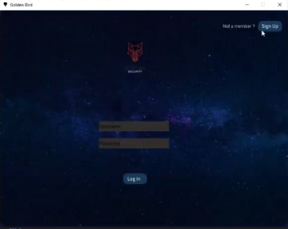
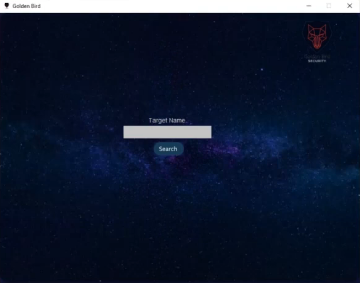

# Golden Bird
#### Video Demo: [Link to the video](https://www.youtube.com/watch?v=f88weWUEO3Q)

#### Description: This is a web scraping project that has a GUI.Becuse of that it is easy to use and it is user friendly 

This is a web scraping app built by python
- This app has 4 pages
    - SignUp page
    - Login Page
    - Searching Page
    - Profile page

## Sign up Page

When Signup users the program checks if the name they provided is in the database the program provides an error
Then the program checks the password is strong enough
If all the above are correct the program will hash the password and register the user into the database

## Login Page

From this page Users can login to the app
When users log in the app will check their username and password
If the password and username are correct they will go to the searching page

## Searching Page

This page only has one input field and a button
In the input field user have to put the targets Instagram username
after filling the input field User have to click the Search button

Then the web scraping starts
After that, there will be a file created name the name of the target
Inside this folder, there will be information and the posts from the target

## Profile page

After all of this, you will have a profile with the all the details from the target Instagram and it will be displayed on a window

# The Files
 - There are 4 files
    - gui.py
    - root.py
    - profile.py
    - webscaponginstagram.py
    - Funtions.py
    - Users.db

## gui.py

- This is the main file of the app this file has the login page and the register page

## root.py

- this file has the search page and from this file, we run the websctaponginstagerm.py

## profile.py

- This file contains the profile page
- from this file, the app reads the data and displays it

## webscaponginstagram.py

- This is the file that does lots of things such as open a browser and go to Instagram, log into the Instagram, search for - the user name, and download the details

## Funtions.py

- This is the file that has SQL commands and password hashing
- when the user login this fille runs and checks if the username and the password are correct
- and if a new user register this fille check if the username is all ready exist and hash the password user put in and put - the user name and the password into the SQL table

## Users.db
- Inside the Users.db fille there is a SQL database containing the hash password and the username
